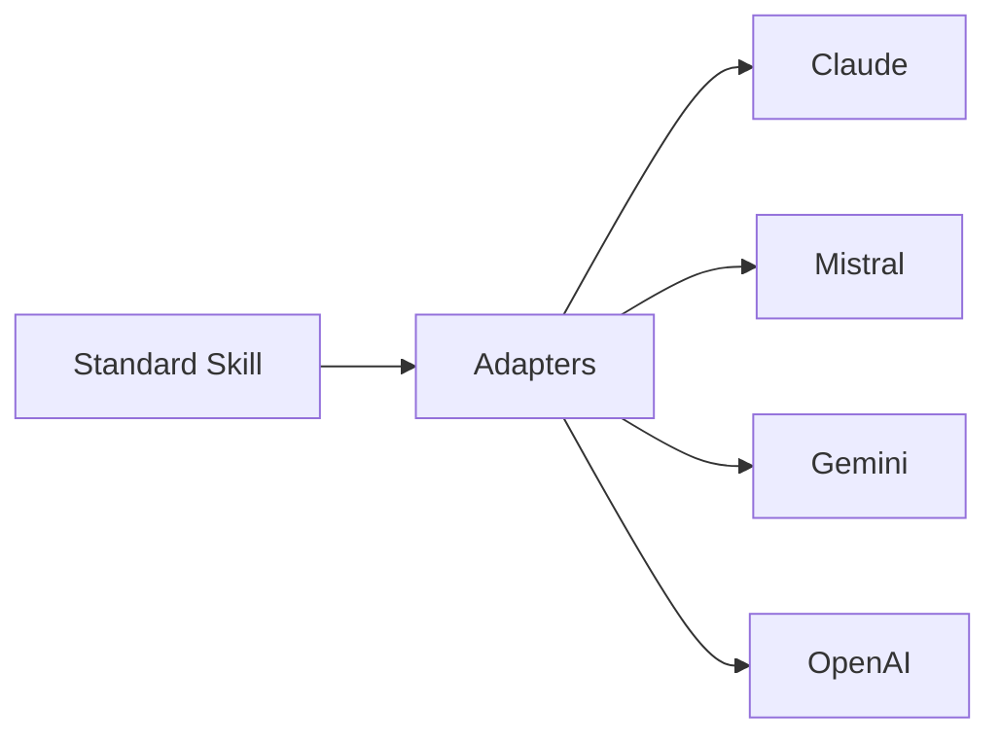

# General Dev Skills

[](LICENSE)
[](https://github.com/mariusbu/general-dev-skills)
[](https://www.anthropic.com/)
[](https://mistral.ai/)
[](https://deepmind.google/technologies/gemini/)

A **multi-AI plugin system** that provides structured development skills for Claude, Mistral, Gemini, and other AI platforms. Each skill delivers workflows, reference materials, and best practices for specific engineering roles.

## 🚀 Multi-AI Architecture

The plugin now supports multiple AI platforms through a standardized skill format and adapter pattern:



## 📦 Installation

### For Claude (Original)

```bash
# Add marketplace and install
/plugin marketplace add https://github.com/mariusbu/general-dev-skills
/plugin install general-dev-skills
```

### For Other Platforms

1. **Install Node.js** (v18+ recommended)
2. **Clone the repository**:
   ```bash
   git clone https://github.com/mariusbu/general-dev-skills.git
   cd general-dev-skills
   ```
3. **Install dependencies**:
   ```bash
   npm install
   ```
4. **Use the adapter for your platform**:
   ```bash
   # Example: Generate Mistral plugin
   node adapters/mistral/generate.js
   ```

## 🎯 Skills

10 general-purpose development skills covering the full software development lifecycle:

| Skill | Triggers | Platforms | Auto/Manual |
|---|---|---|---|
| **Backend Developer** | API design, databases, auth | ✅ All | Auto |
| **Frontend Developer** | UI components, accessibility | ✅ All | Auto |
| **Fullstack Developer** | End-to-end features | ✅ All | Auto |
| **DevOps** | CI/CD, infrastructure | ✅ All | Auto |
| **Solution Architect** | System design, tech selection | ✅ All | Auto |
| **Technical Project Lead** | System assessment, tech debt | ✅ All | Auto |
| **Code Quality & Debugger** | Code reviews, refactoring | ✅ All | `/general-code-quality-debugger` |
| **PM** | Issue creation, planning | ✅ All | `/general-pm` |
| **QA** | Test plans, automation | ✅ All | `/general-qa` |
| **Technical Writer** | Documentation, guides | ✅ All | `/general-technical-writer` |

**Auto**: Triggered automatically based on task context<br>**Manual**: Invoked via slash commands

## 🔧 Architecture

### Core Components

```
general-dev-skills/
├── core/              # Platform-agnostic skills & references
├── adapters/          # AI-specific format converters
├── integrations/     # IDE/CLI integrations
└── plugins/           # Legacy Claude plugin (maintained)
```

### Standard Skill Format

Skills are defined in JSON format for platform independence:

```json
{
  "name": "general-backend-developer",
  "description": "Backend development skills",
  "version": "1.0.0",
  "triggers": ["api", "database"],
  "workflows": ["implement_endpoint"],
  "references": ["clean-code", "solid-principles"]
}
```

### Supported AI Platforms

| Platform | Status | Adapter | Format |
|----------|--------|---------|--------|
| **Claude** | ✅ Production | `adapters/claude` | JSON |
| **Mistral** | 🔧 Ready | `adapters/mistral` | YAML |
| **Gemini** | 🔧 Ready | `adapters/gemini` | Gems |
| **OpenAI** | 🔧 Ready | `adapters/openai` | Functions |

## 🔄 Adapters

Convert standard skills to platform-specific formats:

### Claude Adapter
```javascript
const { ClaudeAdapter } = require('./adapters/claude');
const skill = require('./core/skills/backend-developer.json');

const claudeSkill = new ClaudeAdapter().convert(skill);
```

### Mistral Adapter (Coming Soon)
```yaml
# Mistral plugin format
name: general-backend-developer
model: codestral.mistral.ai
endpoints:
  - path: /api/implement_endpoint
    method: POST
```

## 📚 References

16 comprehensive reference guides covering:

- **Clean Code Principles** - Writing maintainable code
- **SOLID Principles** - Object-oriented design
- **Test-Driven Development** - TDD workflows
- **Architecture Principles** - System design
- **Debugging Methodology** - Problem solving
- **Accessibility Checklist** - Frontend best practices
- **And 10 more...**

All references are in `core/references/` and accessible across all platforms.

## 🛠️ Development

### Adding New Skills

1. **Create skill JSON** in `core/skills/`
2. **Add references** to `core/references/` (if needed)
3. **Test with adapters**
4. **Document** the skill

### Adding New AI Platforms

1. **Create adapter** in `adapters/[platform]/`
2. **Implement** `BaseAdapter` interface
3. **Add tests**
4. **Update documentation**

## 📖 Documentation

- **[Skill Format Specification](core/skills/SKILL_FORMAT.md)** - Standard skill JSON format
- **[Adapter Interface](adapters/README.md)** - How to create new adapters
- **[Migration Guide](docs/MIGRATION.md)** - Moving from v1 to v2

## 📜 License

MIT License - See [LICENSE](LICENSE) for details.

## 🙏 Credits

- Original skills based on [awattar/claude-code-best-practices](https://github.com/awattar/claude-code-best-practices)
- Multi-AI architecture inspired by modern plugin systems
- Adapters follow best practices from each AI platform
=======